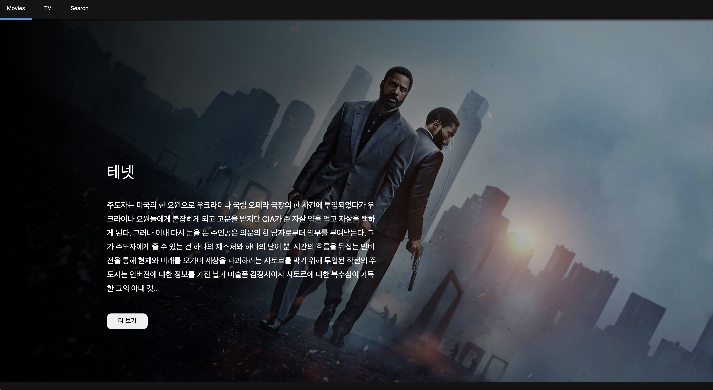
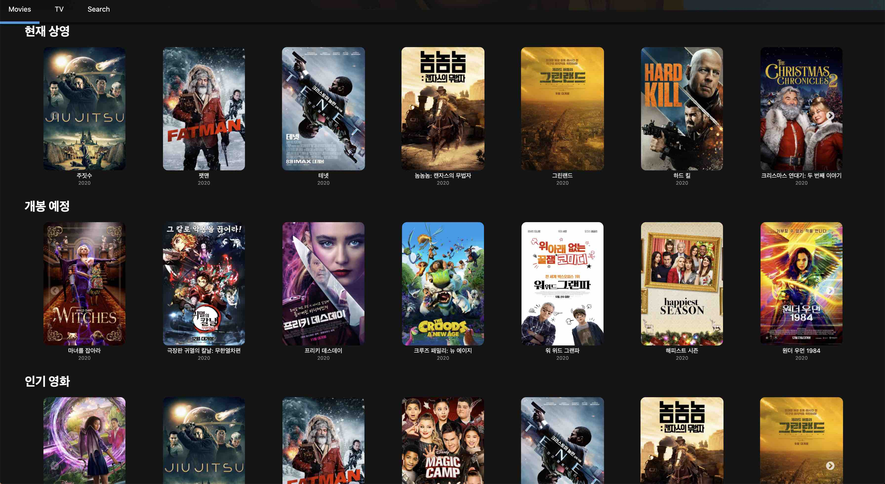
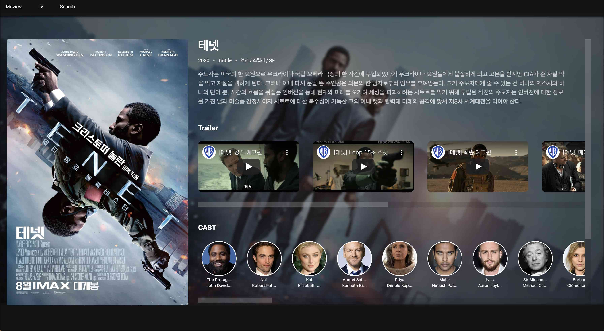
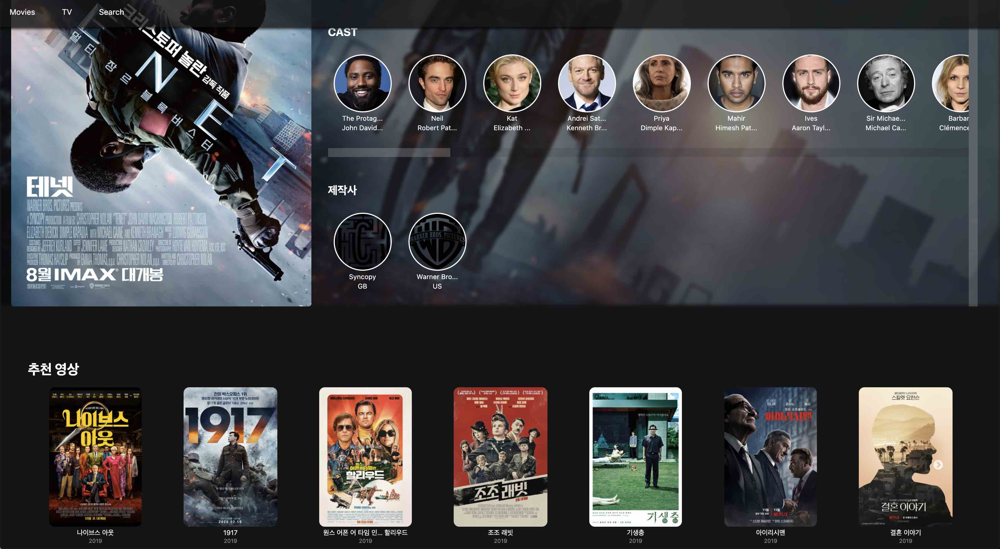

## 🎬 Yflix

The Movie API DB의 API를 활용하여 최신작부터 인기작, 개봉 예정작, 주간 트렌드 작품까지 볼 수 있는 영화, TV프로그램 사이트입니다 해당 작품에 들어가면 예고편과 캐스팅 배우들 제작회사를 볼 수 있으며 연관된 작품까지 볼 수 있습니다 또한 원하는 작품을 검색하여 찾을 수 있습니다 😎

***

### 🎖 구현 기능

#### ✅ Main Title Poster

`react-slick` 을 이용하여 캐러셀 슬라이더를 구현하였습니다 Auto로 작동하며 3초에 한 번씩 슬라이드 됩니다. ✔️ <u >주간 인기작 API</u>를 사용하여 매주 변경됩니다. 관심이 가는 프로그램의 더 보기를 누르면 해당 프로그램의 디테일 페이지로 이동합니다.

#### ✅ Main Category Poster

✔️ <u>현재상영, 개봉예정, 인기영화 또는 최고평점, 인기방송, 오늘의 방송</u> 컨텐츠를 볼 수 있으며 해당 리스트들은 캐러셀 슬라이드를 사용하였습니다 또한 작품에 마우스를 올리면 평점을 볼 수 있으며, TV 나 Movie에 맞는 값을 주기위해 삼항연산자를 사용하였습니다.

#### ✅ Detail Poster

Detail-Page이며 줄거리며 런닝 타임 등 각종 정보들과 ✔️ <u>예고편 영상, 캐스팅된 배우들, 제작사</u>까지 확인할 수 있고 TV에서는 ✔️ <u>시즌정보</u>도 확인 할 수 있습니다

#### ✅ Recommend Poster

해당 작품과 관련이 있는 ✔️ <u>추천작품</u>들을 볼 수 있습니다.
***

### 📌 기술 스택
- React(Class, Hooks)
- React-Router
- Axios
- Styled-Components

***